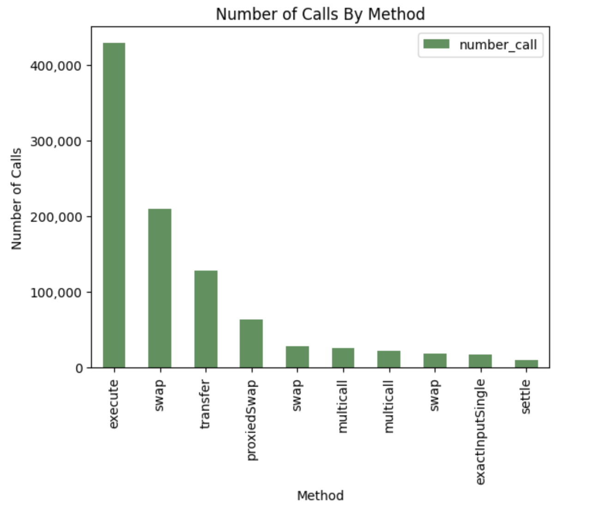
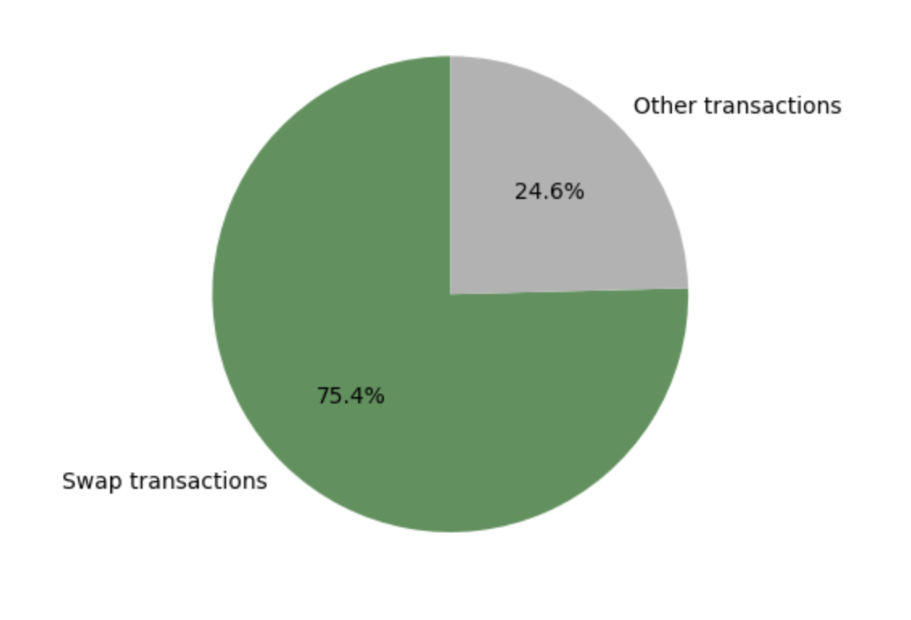
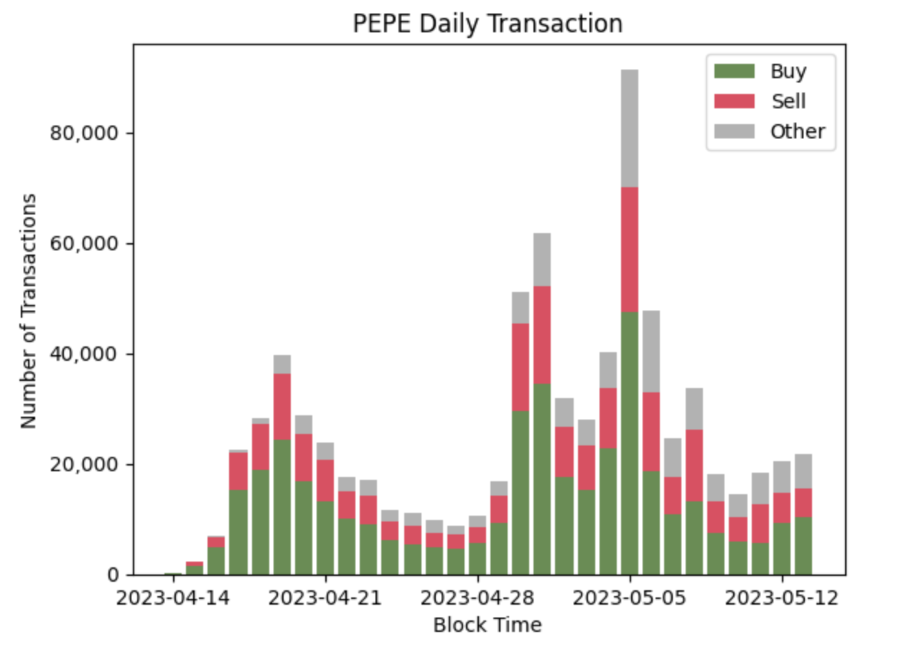
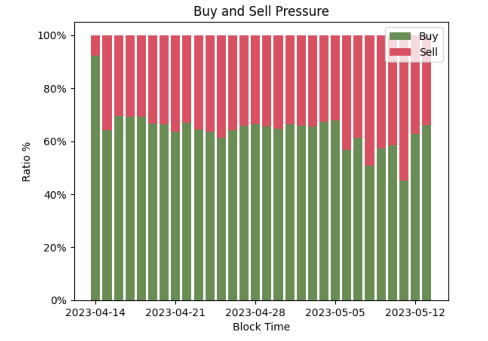
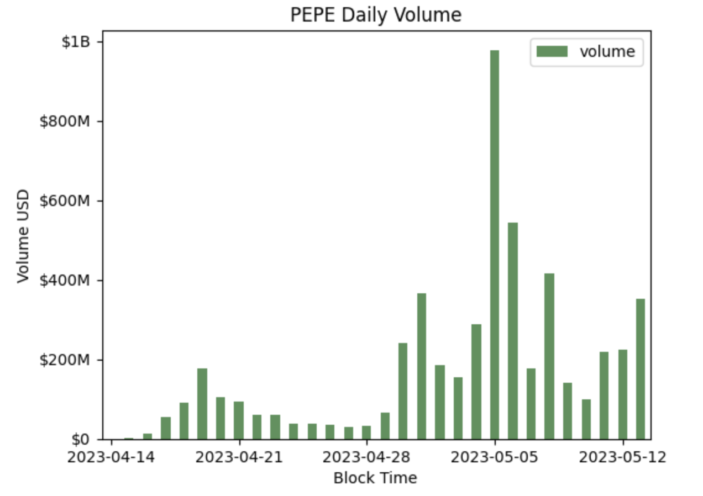
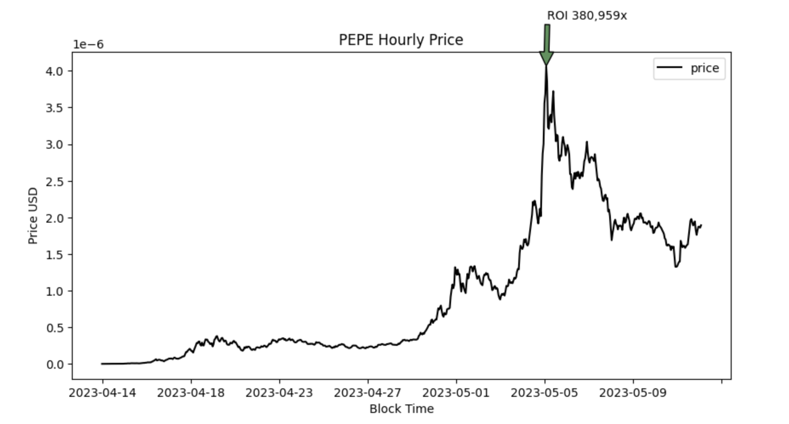
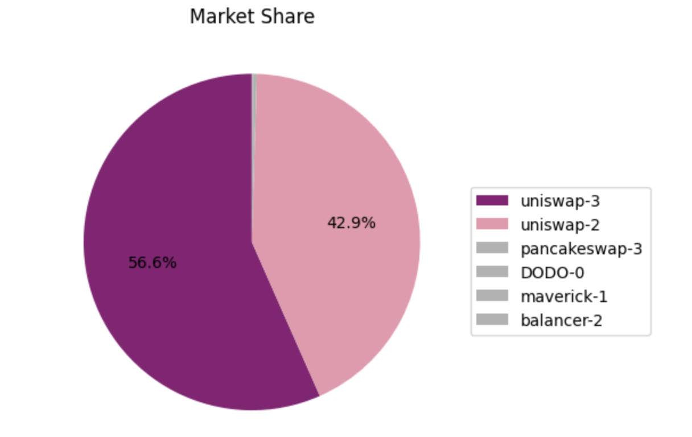

# Phân tích PEPE Token 🐸

## Mô tả
[PEPE](https://www.pepe.vip/) là một token ERC20, được tạo ra bởi một (hoặc một nhóm) người ẩn danh trên mạng lưới Blockchain Ethereum vào ngày [14-04-2023](https://etherscan.io/tx/0x2afae7763487e60b893cb57803694810e6d3d136186a6de6719921afd7ca304a). Giá trị của 1 $PEPE đạt đỉnh vào ngày 05-05-2023, tăng khoảng **380,000 lần** so với ngày đầu phát hành. Với hơn **800,000 giao dịch** (tính đến ngày 21-05-2023).

Vậy có gì trong những giao dịch này? Điều gì khiến một chú ếch xanh có bước nhảy hàng trăm nghìn lần như thế, những ai đã tác động đến thị trường của PEPE? Và một người bình thường có thể đạt được lợi nhuận thông qua việc giao dịch PEPE không?

Thông qua quá trình phân tích dữ liệu onchain của PEPE, sẽ một phần nào đó trả lời được những câu hỏi trên và tìm ra một số pattern của các cá voi khi trading meme token.


## Cài đặt và lấy dữ liệu

**1. Cài đặt môi trường và thư viện (Cho việc phân tích dữ liệu)**

- Môi trường: Python
- Cài đặt thư viện:
```bash
pip install pandas numpy matplotlib networkx requests jinja2
```

**2. Lấy dữ liệu bằng Dune Analytics**

Dữ liệu trên Blockchain có thể được lấy bằng nhiều cách khác nhau, trong đó sử dụng **[Dune Analytics](https://dune.com/browse/dashboards)** là một cách nhanh chóng và tiện lợi để lấy dữ liệu onchain đã được decode.

Các bạn có thể tự tạo query để lấy dữ liệu giao dịch của PEPE hoặc sử dụng các câu query dưới đây:

> Do Dune giới hạn dung lượng download file csv là 1GB và 2 bảng `erc20_ethereum.evt_Transfer` và `dex.trades` trên Dune có khối lượng dữ liệu lớn nên việc join 2 bảng tốn khá nhiều thời gian. Do đó mình tách làm 2 câu query và thực hiện việc join bằng pandas.

[Get swap transacions](https://dune.com/queries/2451707)
### 
```sql
-- Default values
-- {{blockchain}} = ethereum
-- {{token_address}} = 0x6982508145454Ce325dDbE47a25d4ec3d2311933
-- {{start_time}} = 2023-04-14
-- {{end_time}} = 2023-04-15

SELECT
    -- blockchain,
    CONCAT(project, '-', version) AS project,
    -- block_date,
    block_time,
    token_bought_symbol,
    token_sold_symbol,
    -- token_pair,
    token_bought_amount,
    token_sold_amount,
    -- token_bought_amount_raw,
    -- token_sold_amount_raw,
    amount_usd,
    -- token_bought_address,
    -- token_sold_address,
    -- taker,
    -- maker,
    -- project_contract_address,
    -- trace_address,
    -- evt_index,
    tx_hash,
    tx_from,
    tx_to
FROM dex.trades
WHERE blockchain = '{{blockchain}}'
    AND (
        token_bought_address = {{token_address}}
        OR token_sold_address = {{token_address}}
    )
    AND block_time BETWEEN TIMESTAMP '{{start_time}}' AND TIMESTAMP '{{end_time}}'
ORDER BY block_time
```

[Get transfer transactions](https://dune.com/queries/2494730)
###
```sql
-- Default values
-- {{blockchain}} = ethereum
-- {{token_address}} = 0x6982508145454Ce325dDbE47a25d4ec3d2311933
-- {{start_time}} = 2023-04-14
-- {{end_time}} = 2023-04-15

SELECT
    tx.block_time
    , tx.block_number
    , tx.hash
    -- , tx.value
    -- , tx.gas_limit
    , tx.gas_price
    , tx.gas_used
    -- , (tx.gas_used * tx.gas_price) / 1e18 AS tx_fee
    -- , tx.max_fee_per_gas
    -- , tx.max_priority_fee_per_gas
    -- , tx.priority_fee_per_gas
    , tx.nonce
    -- , tx.index
    , tx."from"
    , tx."to"
    , SUBSTRING(CAST(tx.data AS VARCHAR), 1, 2 + 8) AS method_id
    -- , tx.data
    -- , tx."type"
    -- , tx.access_list
    -- , evt_transfer."from" AS sender
    -- , evt_transfer."to" AS receiver
FROM erc20_{{blockchain}}.evt_Transfer AS evt_transfer
LEFT JOIN {{blockchain}}.transactions AS tx
    ON tx.hash = evt_transfer.evt_tx_hash
    AND tx.block_time BETWEEN TIMESTAMP '{{start_time}}' AND TIMESTAMP '{{end_time}}'
WHERE evt_transfer.contract_address = {{token_address}}
    AND evt_transfer.evt_block_time BETWEEN TIMESTAMP '{{start_time}}' AND TIMESTAMP '{{end_time}}'
ORDER BY 2 DESC
```

## Phân tích

### Tổng quan
Trong gần 40 ngày giao dịch đã có:
    
- **822,804 giao dịch** được thực hiện
- **183,322 users**
- Tổng Khối lượng giao dịch đạt hơn **5 tỷ đô**
- Tổng số ETH trả cho phí giao dịch: **12,064 ETH**

Trong ngày đầu tiên khi thanh khoản được cung cấp, đã có **61 "early bird"** (address) được tạo ra chỉ để mua PEPE. Những address này không phải ngẫu nhiên mà đều có sự liên kết với cách thức giao dịch giống nhau. Mình tìm được 3 nhóm address như hình bên dưới, các address khác cũng có phương thức tương tự nhưng chuyển vào các ví mới nên mình chưa tìm được sự liên kết.


### Giao dịch 

Ngoài `swap` và `transfer` thì gần như token PEPE không được sử dụng trong bất kỳ trường hợp nào khác.



Các giao dịch `swap` chiếm **75.4%** trong tổng số các giao dịch đã thực thi. Chiếm phần lớn trong số 24.6% các giao dịch còn lại là các giao dịch `transfer`.



Điều này diễn tả đúng với disclaimer của PEPE team khi tạo ra token này, chỉ để giải trí và không có giá trị nội tại 🐸.


Các **giao dịch mua** chiếm tỷ trọng lớn kể từ khi PEPE được giao dịch.





### Volume and Price

Nhìn chung với một meme thì volume của PEPE từ những ngày đầu đã khá lớn so với những token khác trong tình hình thị trường downtrend.



Có một điều gì đã xảy ra vào ngày 05-05 đã khiến độ fomo của PEPE đạt đỉnh khiến khối lượng giao dịch và giá token PEPE bắt đầu tăng đột biến. Sau đó chỉ 1 ngày, PEPE đạt ATH với **ROI ~380 nghìn lần**.
> j4f: Nếu đầu tư $1 vào PEPE vào ngày 14-04 và bán vào ngày 06-05 thì bạn sẽ có $380,000 🤑



Vì là một token trên Ethereum nên thanh khoản tập trung hầu hết trên Uniswap.



### Vậy những ai đã làm khiến PEPE trở nên hấp dẫn như vậy?

**Top 10 khối lượng giao dịch**

|    | Address  | Note  | Volume |
|----|----------|-------|--------|
| 1  | 0xae2fc483527b8ef99eb5d9b44875f005ba1fae13 | jaredfromsubway.eth, MEV | $596,395,801 |
| 2  | 0xd985c35f566c9de55df16ade36852b0c40f4bf59 | MEV | $159,873,310 |
| 3  | 0xf1d307906edc902dc2c392af2880f43a55d3583a | MEV | $94,425,641 |
| 4  | 0xb722e4d12d4c0ec0309856e32c4f7df9c05a11fb | MEV | $66,011,846 |
| 5  | 0x758e8229dd38cf11fa9e7c0d5f790b4ca16b3b16 | MEV | $61,443,605 |
| 6  | 0xb58555fcba6479fced7de1485eb054943a09af7b | MEV | $55,737,365 |
| 7  | 0x381b7d64303a2a5251ac12ee147ffdb337da5969 | MEV | $51,931,828 |
| 8  | 0xd9d9cb8037d8a11a511398c3a790ded9bdf21b08 | *🀢🀣🀤🀥.eth | $42,040,175 |
| 9  | 0x76f36d497b51e48a288f03b4c1d7461e92247d5e | MEV | $41,181,994 |
| 10 | 0xa009fa1ac416ec02f6f902a3a4a584b092ae6123 | MEV | $40,206,754 |

> MEV Bot ở khắp mọi nơi 🤖


**Top 10 RealizedPnL**

> RealizedPnL của một address được tính dựa trên các giao dịch swap onchain của ví đó (Không bao gồm việc chuyển token sang các ví khác hay chuyển token lên các sàn tập trung)

|    | Address  | Note  | Number of swaps | RealizedPnL |
|----|----------|-------|-----------------|-------------|
| 1  | 0xb722e4d12d4c0ec0309856e32c4f7df9c05a11fb | MEV | 1882 | $66,011,846 |
| 2  | 0xfd9ce48c96617bf6ccc7c37044b1a22638b71e02 |  | 477 | $11,263,332 |
| 3  | 0xc32ad590d92db58931dcedd99e10d077530ccaa9 |  | 49  | $10,035,381 |
| 4  | 0x511d452b738b3f1ada0e74e7a3412f5d975fc548 | MEV | 705 | $9,564,909 |
| 5  | 0x4a2c786651229175407d3a2d405d1998bcf40614 | dimethyltryptamine.eth  | 508 | $9,096,246 |
| 6  | 0x2cc9aecaec5a7577d27b80afb70b8fda55ee68c0 |  | 211 | $7,549,952 |
| 7  | 0x03770b07c5c315722c5866e64cde04e6e5793714 |  | 127 | $7,144,450 |
| 8  | 0x45cf108e79374ad324904c22847569609f48e33c |  | 319 | $7,138,063 |
| 9  | 0x31a9ec3a6e29039c74723e387de42b79e6856fd8 | MEV | 514 | $6,598,426 |
| 10 | 0xcffff9aa43accc00dd58e76159e9e1789b4b30ee |  | 415 | $5,945,858 |


